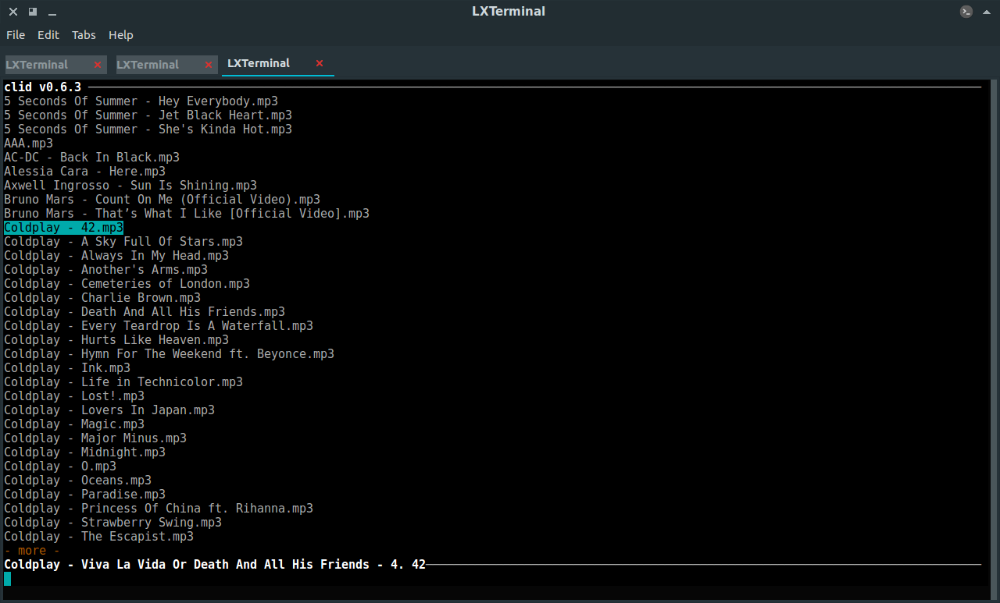
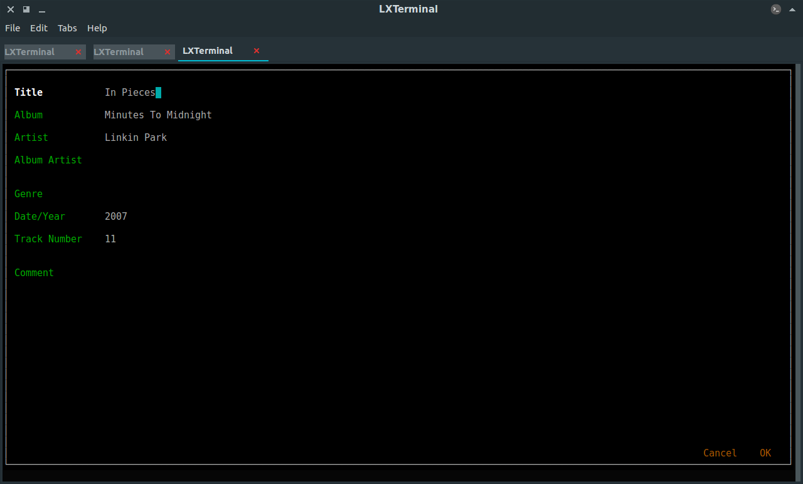

# clid

Clid is a command line app written in Python3 to manage your mp3 files' id3v2 tags. I love [cmus](https://github.com/cmus/cmus), and tried to find 
something similar for editing the tags. None of them could do what I want - edit them in an interface similar to cmus(ncurses
based). So I came up with clid. I'm still working on the basics.

This project is made with [npyscreen](https://bitbucket.org/npcole/npyscreen), a python wrapper around ncurses, making it easier
to craft command line apps.

## Installation

The app will soon be pip-installable, until then, you could just clone the repo and use it:

```shell
git clone https://github.com/GokulSoumya/clid.git
sudo pip3 install npyscreen  # install dependencies
cd ./clid
python3 -m clid  # launch the app
```

> Note: You should have `python3` and `pip` installed to use the app

## Usage

### Viewing Files

The main window will show the mp3 files you have in `~/Music`. The interface is similar to that of cmus:



You will have a command line at the bottom of the window, to recieve commands. You will also see a live preview of the
common tags of the file under the cursor.

> Note: The status line shows the tags in `artist - album - track_number title` format

### Editing Tags

To edit the tags of a file, simply hit <kbd>Enter</kbd>(or <kbd>Return</kbd>). You will see a new window:



Use the arrow keys to move through the tags; edit them if needed and hit `OK` when you're done(`Cancel` will discard changes).

### Editing Preferences

To edit preferences, press `2`. Then hit <kbd>Enter</kbd> on the highlighted setting to edit it (it will be then shown
at the bottom of the screen; edit it and hit <kbd>Enter</kbd> again).
